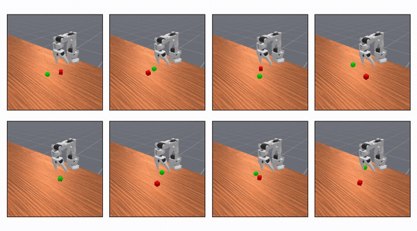
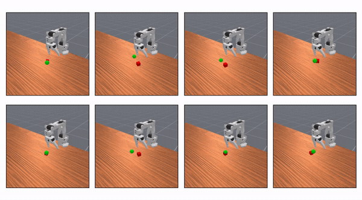
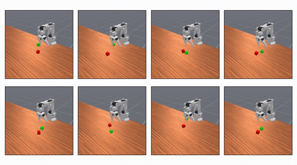

## CS372 Robot Arm — PPO for ManiSkill PickCube (Simulation)

### What it does

This project trains a **PPO reinforcement learning policy** in the **ManiSkill `PickCube-v1`** simulation task (with the `so100` robot) and evaluates learning progress over training iterations using quantitative curves (reward, episode length, actor/critic losses) and qualitative rollouts (progression videos).

### Project goal

Train a policy that **reliably completes `PickCube-v1` and does so efficiently**, then show that improvement over time through the logged evaluation metrics.

### Why this is meaningful

Robot manipulation is a core research problem, and standardized simulation benchmarks let us evaluate learning-based control reproducibly.

- **Benchmark**: ManiSkill manipulation suite (`PickCube-v1`) (research benchmark / competition-style task suite).  
- **Algorithm**: PPO (Schulman et al.), a widely used baseline for continuous-control RL.

### Quick Start

- **Setup**: follow `SETUP.md`
- **Run training + plots**: open and run `rl/ppo.ipynb`
- **View results**:
  - learning curves: `rl/Training Data.csv` (also plotted in the notebook and shown below)
  - rollout progression: see the GIFs in the “Video Links” section below

### Video Links

- **Project demo video (non-technical)**: *TODO: add link*
- **Technical walkthrough video**: *TODO: add link*

### Demo video (non-technical) — training progression (GIFs)

These GIFs play inline in GitHub and show qualitative improvement across training stages (MP4s are in `media/` if you want higher quality).

- **Preliminary** — moves near the cube but struggles to grasp it  
  
- **In progress** — grasps the cube but struggles to reach/complete the goal  
  
- **Final** — completes the full task (grasp + goal)  
  

### Technical walkthrough

#### 1) Task definition

- **Environment**: ManiSkill `PickCube-v1` with `robot_uids="so100"`.
- **Goal**: complete the pick-and-lift task; the notebook treats **`reward == 1.0`** as the success/completion signal.

#### 2) Environment configuration

In the notebook we instantiate:

- `env = gym.make("PickCube-v1", num_envs=128, obs_mode="state", control_mode="pd_joint_delta_pos", render_mode=None, robot_uids="so100")`
- Then wrap with `env = ManiSkillVectorEnv(env, auto_reset=False, ignore_terminations=False)`

Why these choices:

- **`obs_mode="state"`** keeps the project focused on control learning (no vision model).
- **`pd_joint_delta_pos`** gives a continuous joint-delta action interface that PPO can learn over.
- **`num_envs=128`** vectorizes experience collection (one “batch” is many parallel rollouts).

#### 3) PPO model

The notebook implements PPO as an actor–critic with fixed-size MLPs:

- **Actor**: `obs_dim → 512 → 512 → 512 → act_dim` with `ReLU` activations and a final `Tanh`.
- **Critic**: `obs_dim → 512 → 512 → 512 → 1` with `ReLU` activations.
- **Action distribution**: a multivariate diagonal **Normal** with:
  - mean = actor output
  - **fixed std** vector (`self.std`, e.g. `std=0.3` in the notebook run)
  - actions are sampled and the **log-prob** is tracked for PPO’s ratio.

Key PPO hyperparameters used in the example run cell:

- `actor_lr=1e-3`, `critic_lr=5e-3`
- `clip=0.1` (PPO clipping range)
- `gamma=0.95`

#### 4) Data collection

Each training iteration calls `run_batch()`:

- Reset env, then loop step-by-step until **all** parallel envs have terminated/truncated.
- At each step:
  - store observations
  - sample action from the actor and step the env
  - store action and log-prob
  - store reward and a “mask” indicating which envs are still active

#### 5) Reward shaping

The notebook explicitly shapes reward during rollout:

- **Success bonus**: `reward += (reward == 1.0) * success_bonus`
- **Time penalty**: `reward -= time_penalty`

In the example training cell, these are set to:

- `time_penalty=1`
- `success_bonus=10.0`

This is the main lever that improved behavior across Preliminary → In progress → Final.

#### 6) Returns, advantage, and PPO update

After collecting a batch:

- **Returns** R_t are computed by a discounted backward pass using `gamma`.
- The critic predicts values V(s_t).
- **Advantage** A_t = R_t - V(s_t) is computed and then **normalized** to improve stability.

Then PPO performs `update_steps` gradient steps per batch (default `update_steps=5`):

- Compute log-probs under current policy, form `ratios = exp(new_logp - old_logp)`.
- **Clipped surrogate objective**:
  - `surr1 = ratios * A`
  - `surr2 = clamp(ratios, 1-clip, 1+clip) * A`
  - actor loss = negative mean of `min(surr1, surr2)` (masked over valid timesteps)
- **Critic loss**: masked MSE between `V(s)` and returns.

#### 7) Training schedule + saving/logging

The notebook runs:

- `model.train(num_batches=1_000, patience=None, save_freq=10)`

Every `save_freq` batches (and at the end), it writes:

- **Weights**:
  - `rl/ppo_actor.pth`
  - `rl/ppo_critic.pth`
- **Metrics CSV**: `rl/Training Data.csv` with columns:
  - `Actor Losses`, `Critic Losses`, `Total Rewards`, `Avg Lengths`

Note: the notebook appends to the CSV in chunks every `save_freq` batches.

#### 8) Evaluation

We evaluate learning with:

- **Quantitative curves** over iterations:
  - `Total Rewards` should trend upward
  - `Avg Lengths` should trend downward once success is common (faster completion)
  - losses should stabilize (diagnostic)
- **Qualitative progression**:
  - the three GIFs in `media/` show early/mid/final behavior improvements.

### Evaluation

The project objective is to succeed and do so efficiently. We evaluate with:

- **Total reward** (`Total Rewards` in `rl/Training Data.csv`)
- **Average episode length** (`Avg Lengths`) — lower is better if success is maintained
- **Actor/Critic loss curves** (`Actor Losses`, `Critic Losses`) — stability diagnostics
- **Training iterations**: curves are tracked over `num_batches` (default `1_000`)
- **Qualitative rollouts**: the three progression clips (Preliminary → In progress → Final)

**Learning curves (final run)**:

*TODO*: report **success rate over N evaluation episodes** as a single headline metric.

### Design choices (explicit justification)

- **`obs_mode="state"`**: focuses the project on learning control, avoiding the additional complexity of learning from pixels.
- **`control_mode="pd_joint_delta_pos"`**: stable continuous-control interface for PPO (small joint updates per step).
- **Reward shaping**:
  - **Time penalty** reduces “wandering” behavior and encourages efficiency.
  - **Success bonus** increases the learning signal for completion.

### Repo structure

- **Training notebook**: `rl/ppo.ipynb`
- **Training logs**: `rl/Training Data.csv`
- **Model weights**: `rl/ppo_actor.pth`, `rl/ppo_critic.pth`
- **Media**: `media/` (GIFs + MP4 clips)

### Individual Contributions (template)

*TODO: fill in names + responsibilities.*

- **Person A**: environment setup, PPO implementation, training runs
- **Person B**: reward shaping experiments, evaluation metrics/plots
- **Person C**: demo videos, README/documentation, presentation