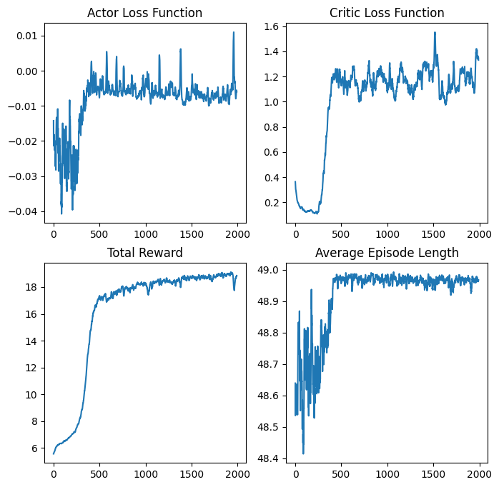
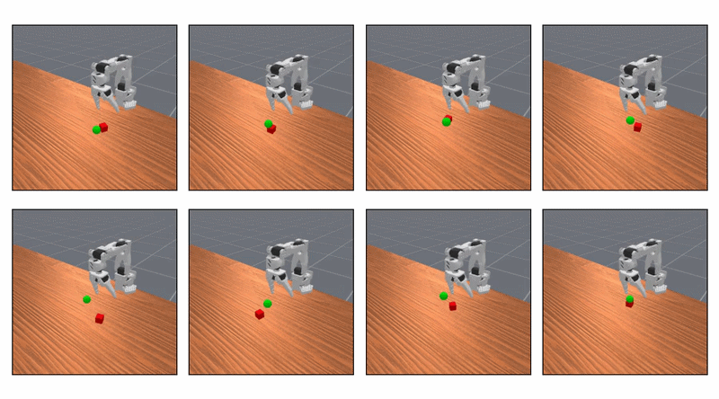
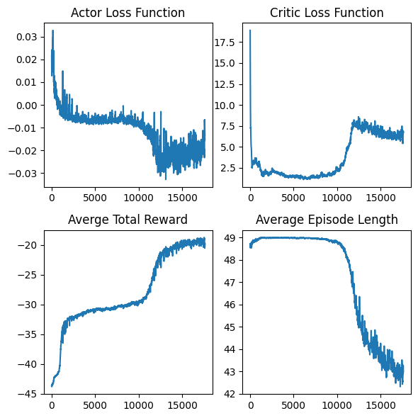

# Reward Shaping
One of the most significant improvements we made to our model was shaping the defautl rewards generated by the `PickCubeV1` task. Early iterations of the model were able to move toward and grasp the cube; however, they struggled to move the cube toward the goal. After viewing the training plots and simulation renders, it became clear that the model was trying to maximize rewards by running as long as possible while collecting moderate rewards. This can be seen qualitatively in the video below quantitatively in the stagnation of the average episode length in the training plot below.

This issue was solved by implementing both a significant time step penalty (larger than any non-success reward) and a large success bonus. The time step penalty discourages the model from running any longer than absolutely necessary since every timestep (besides the final, successful one) is guaranteed to produce a negative reward. Furthermore, the addition of a large success bonus then helps the model recognize and converge towards the successful end state during training. As a result of these changes, the model finally began completing the task, as can be seen in the video and plot below. 

